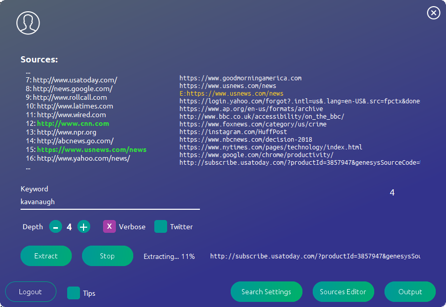

# StoryGrab
Required libraries are all included in repository.  
StoryGrab takes a list of news sources (no limit) and searches them for the specified keyword.

# Screenshots: 
Login screen:

Main screen (current):
 
In action:

