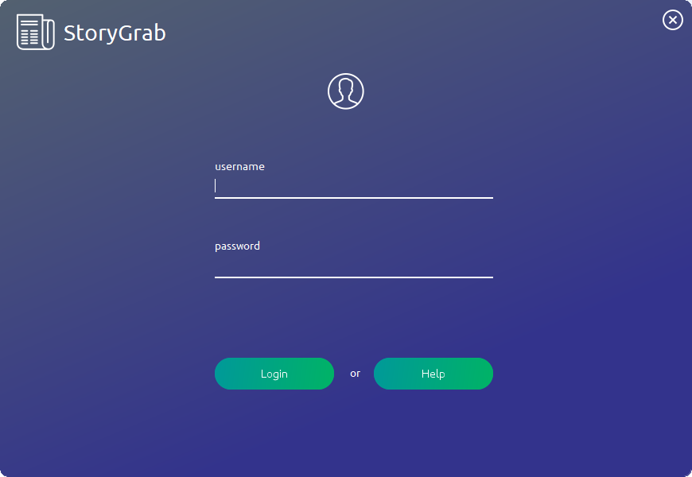
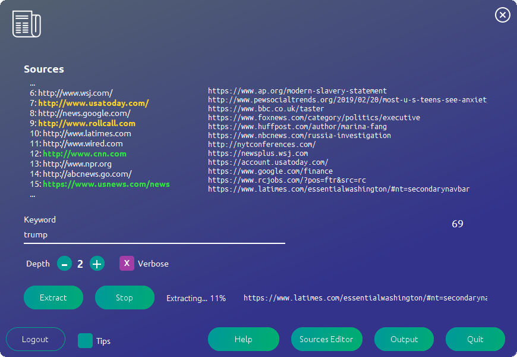
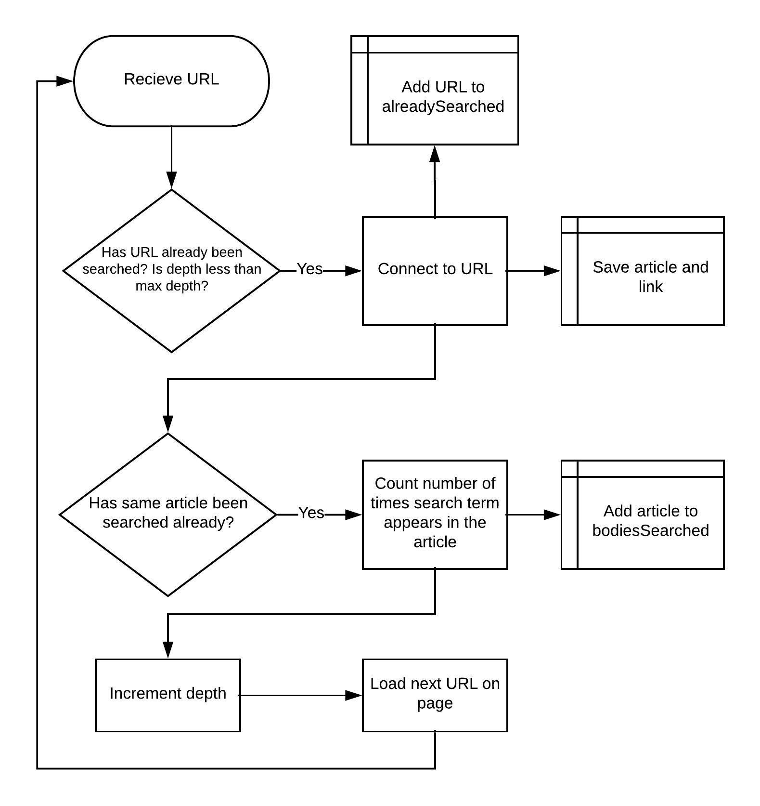
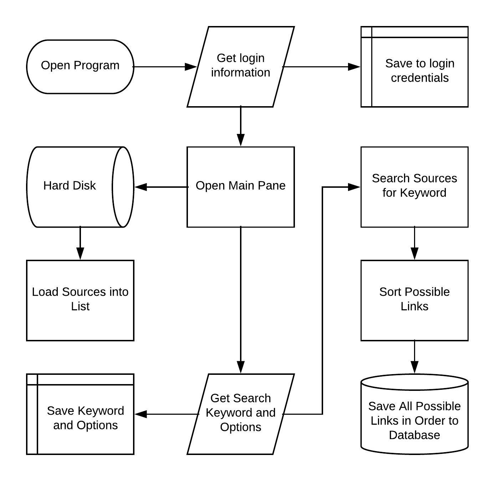
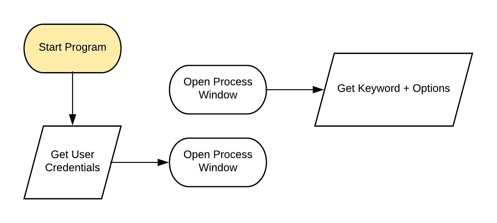
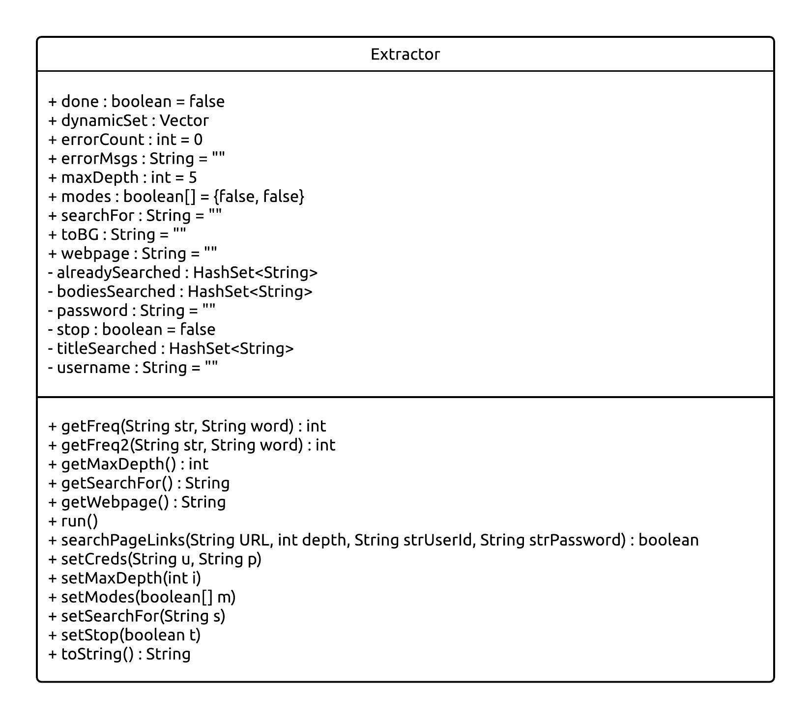
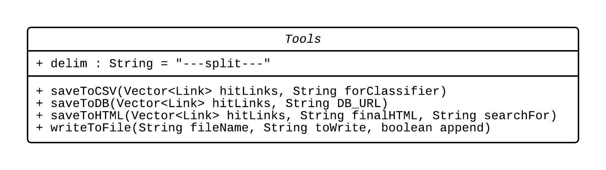
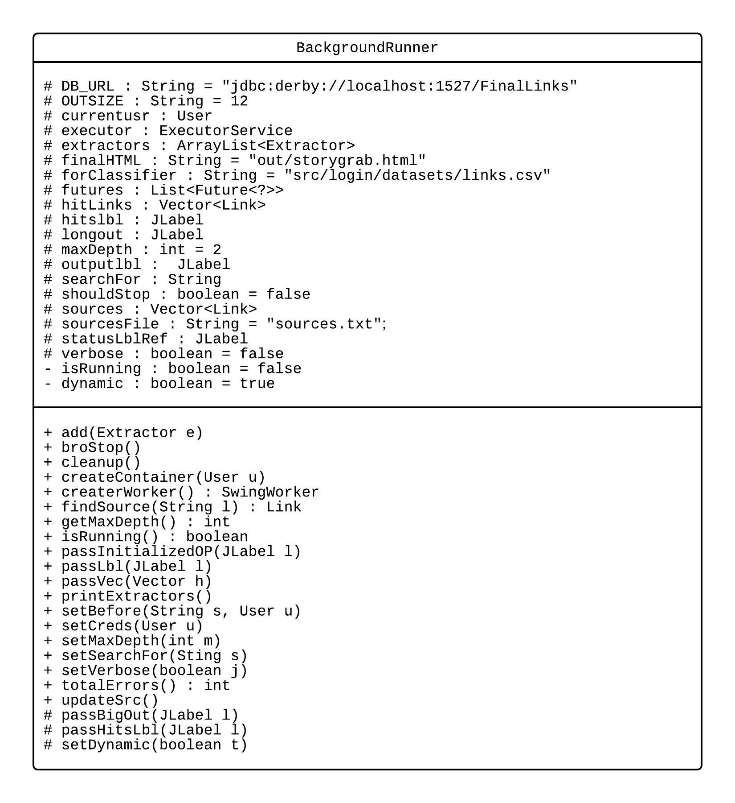
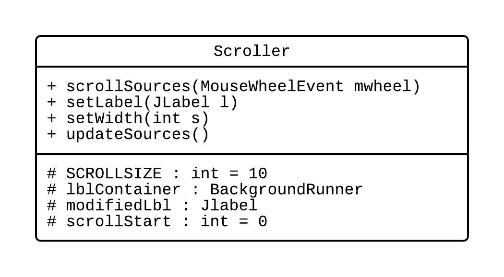
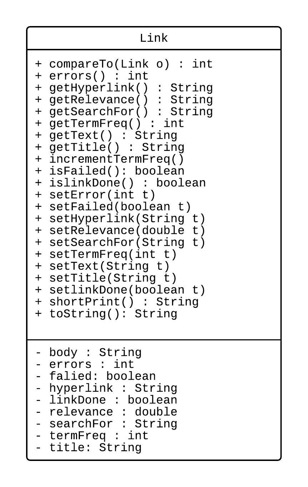

StoryGrab
=========

StoryGrab takes a list of news sources (no limit) and searches them for the
specified keyword. Required libraries are all included in repository. \#\#\# IA
write-up

Criterion A: Planning

The problem I am tackling for my IA is for the ComOps department at AEP. ComOps
deals with the buying and selling of power. They needed a way to find news about
the price of power and really all things that would interest that department on
consumer sites. The goal of my program will be to get a list of webpages that
could be potentially relevant to a certain keyword. Google does not do this for
them because Google a) does not do the best job of sorting by relevance in this
instance, and b) does not write to a database. The client’s name is Joe Sheridan
and he is in the ComOps department. A family member of mine has worked with him
on a few occasions and that’s how I got in contact with him.

Rationale for Solution
======================

My Java program will search a list of sources for a given keyword and write the
output to a database sorted by relevance. The sources will include most consumer
news sites and will also include a Twitter API as well as the option to add more
sources. Pre-installed sources will include

-   <http://bbc.com/>

-   <http://foxnews.com/>

-   <http://www.huffingtonpost.com/>

-   <http://www.nbcnews.com/>

-   <http://www.nytimes.com/>

-   <http://www.wsj.com/>

-   <http://www.usatoday.com/>

-   <http://news.google.com/>

-   <http://www.rollcall.com>

-   <http://www.latimes.com>

-   <http://www.wired.com>

-   <http://www.cnn.com>

-   <http://www.npr.org>

-   <http://abcnews.go.com/>

-   <https://www.usnews.com/news>

-   <https://www.yahoo.com/news/>

-   <https://www.ap.org/en-us/>

In order to read these sources, I’ll need to use a third-party library to
connect to the webpage and save the data to a field in the program. I’ll also
need to design a searching algorithm to write to some sort of List storing the
increasing number of “hits.” I plan on making the GUI fully functioning at all
times, so I will need to use Thread to stop the program from hanging while the
sources are being searched. Finally, the user will need to possess some way of
reading the output, possibly through a web browser or, as Mr. Sheridan would
also like, a database.

I decided to implement the solution in Java 8 because:

-   Fairly easy to create GUI with

-   Object-oriented language so my multi-class design fits well

-   Easy-to-follow syntax

-   Free to download and distribute

Success Criteria
================

-   Must search for the given keyword

-   Results must be at least reasonable

-   Execution time should be low

-   Program must be efficient (multithreading)

-   Interface must be intuitive and easy to use

-   Output must be easy to interpret and easy to find

-   Code must be readable with comments

-   Interface should look modern[^1]

    [^1]: Criterion A Word Count: 428 words

Criterion B: Solution Overview

Designing a solution for a problem of this scope can be a very entertaining
process. I decided to create it from the outside in – first starting with the
GUI (Graphical User Interface), and then moving down into the “brain” of the
program. I paid very close attention to detail and spent probably around 16
hours designing the GUI to look and feel very professional. After I had finished
the bulk of the GUI, I transitioned to working on the search algorithm and
interfacing that with each of the classes.

At first, I had designed part of the program to use Vector. There was only one
final link set that every instance of Extractor wrote to. This was a problem
because a) Vector has been obsolete since Java 2[^2], and b) this slowed down
the overall execution time. Vector is synchronized each iteration. This is more
convenient, but it’s slower. So, I replaced it with ArrayList and it became
hitLinks.

[^2]: <https://docs.oracle.com/javase/7/docs/api/java/util/Vector.html>

Object Design
=============

The program will have three forms: a login form (to use with the firewall), a
main screen (to operate the extractors from), and a help menu. The color scheme
for all three contains blue, grey, and green as the primary colors, and the font
family is Ubuntu. The login screen is as follows:

The interface for the main screen is designed for maximum information. The more
the user knows about what is going on and how far the program has progressed,
the better.

The help menu aims to provide clarity to any possibly vague instructions on the
main program.

Flowcharts
==========

Class Diagrams
==============

Using object-oriented programming, I designed this project with 9 classes. They
all interact with each other and make use of polymorphism, encapsulation, and
inheritance.

Class Overviews
===============

There are 9 classes in StoryGrab, together totaling around 2700 lines of code.

**LoginWindow.java**

LoginWindow is the main class of the solution. It contains the code for the GUI
as well as functions for the button actions. This class serves as the front-end
and interface for the main algorithms.

**BackgroundRunner.java**

BackgroundRunner is the class that, using SwingWorker, allows the GUI to respond
while the search algorithm is running. It is also responsible for controlling
the multithreading and collecting all the data into a final list.

**Extractor.java**

The Extractor class contains the main searching algorithm. This method, which
will be explained in more detail later, is a simple recursive bit of code.

**Scroller.java**

Scroller contains methods that work together to allow the user to control the
lines that show up in a GUI panel with the mouse wheel. This is implemented in
LoginWindow so that the user can see all the sources that are scanned and their
corresponding statuses.

**AutomaticScrollUpdater.java**

To make the program more efficient, Scroller does not update every iteration of
the main loop. Instead, it updates every 200 milliseconds. This class runs in
the background and uses SwingWorker to be non-blocking.

**Tools.java**

Tools is the only abstract class in this project. It contains three important
functions: saveToCSV, saveToHTML, and saveToDB. They are used to save the output
of the program to certain files to be viewed elsewhere.

**Link.java**

Link contains all the attributes of a Link object, such as title, hyperlink, and
body. Implemented correctly, it is an easy way to collect all the data from one
webpage and keep it all together.

**HelpMenu.java**

HelpMenu is a GUI form that gives the user help when they ask for it.

**User.java**

User collects the data of a user, just username and password, and stores it in
an object.

Development Pseudocode
======================

These give a general overview of what the most critical methods do.

Test Plan
=========

These tests are here to ensure the solution meets the requirements

| Action to test                               | method of testing/expected result                                                                |
|----------------------------------------------|--------------------------------------------------------------------------------------------------|
| Login screen is effective                    | Try to login to the firewall and access the internet from the program                            |
| Main screen is fluid and easy to use         | Try to move the screen around and play with it to make things crash                              |
| All button clicks work                       | Test clicking each button                                                                        |
| Extracting algorithm is accurate             | Test searches with different depths and keywords and see if the output is reasonable             |
| Scroll method works                          | Try scrolling in the source pane and make sure it works right                                    |
| Help menu is helpful                         | Give the program to a new user and see if they can operate it without help                       |
| Source editor does not cause problems        | Try to add a source from the source.txt file and make sure it does not fail to the backup        |
| Output is readable and accurate              | Run the program and make sure the output makes sense                                             |
| Stop button saves correctly                  | Try terminating the program during execution and make sure the data is not corrupted in any way  |
| Quit button does not crash but exits cleanly | Try terminating the program with the “quit” or “cancel” buttons                                  |
| Colors in the scroll pane make sense         | Run the program and watch the colors in the scroll pane and make sure nothing unexpected happens |

Record of Tasks
===============

| TASK \# | PLANNED ACTION            | PLANNED OUTCOME                                 | TIME ESTIMATED | TARGET COMPLETION DATE | CRITERION     |
|---------|---------------------------|-------------------------------------------------|----------------|------------------------|---------------|
| 1       | Meet with Joe             | Get project idea. Stimulate thought             | 30 minutes     | Completed May 2018     | A             |
| 2       | Meet with Joe             | Get plan Get enough to work on for a while      | 1 hour         | 8/2018                 | A             |
| 3       | Work on project           | get work done No goal, just as much as possible | 15 hours       | 12/2018                | C             |
| 4       | Make flow charts          | Finished flow charts                            | 4 hours        | 1/2019                 | B             |
| 5       | Make UML diagrams         | Finished UML diagrams                           | 3 hours        | 1/2019                 | B             |
| 6       | Make test cases           | Finished test cases                             | 2 hours        | 2/2019                 | B             |
| 7       | Solution tested by client | Updating code                                   | 30 minutes     | 2/2019                 | B/C           |
| 8       | Finalize code             | Finished code                                   | 10 hours       | 2/2019                 | C             |
| 9       | Finish writeup and video  | Project completed                               | 12 hours       | 2/2019                 | A, B, C, D, E |

[^3]

[^3]: Criterion B Word Count: 830 words

Criterion C: Development

Basic Overview of Operation
===========================

StoryGrab uses many classes working tightly together to achieve the fluidity
that it does. LoginWindow acts a net for every input, taking user feedback and
distributing it to where it needs to go. Recall that StoryGrab takes an almost
infinite number of sources to search for. Also familiarize yourself to the
concept of an Extractor object: a shell for a recursive search algorithm that
contains all methods needed to effectively search a webpage. This class saves
the hits to an ArrayList called hits. Note that Extractor extends the Thread
class. Extractor objects are not meant to be operated directly from LoginWindow.
Instead, they are run from BackgroundRunner, which acts as a container and
runner for each instance of the Extractor class (one for each source).
BackgroundRunner also implements the SwingWorker class. This allows
BackgroundRunner to process in the background and to be non-blocking. Now,
running each extractor sequentially would be a mistake. This would make
execution take much longer than it really has the potential to do with
multithreading.

Because Extractor can be created as a Thread object, it retains Thread methods
such as start() and join(). Extractor objects are all started individually on
the search term defined in BackgroundRunner. Until they have all finished
executing, the program (in BackgroundRunner) continuously checks if they are
done. When they are all finished, they are joined together using Thread.join()
and each respective hits is combined into a sorted final set called hitLinks.
Using the static methods of abstract class Tools, this set is then saved to an
HTML file to be viewed in a browser.

List of Techniques
==================

This program uses all the following techniques:

-   Graphical user interface

-   Global and local variables

-   Recursion

-   Search algorithms

-   Merging data structures

-   Polymorphism

-   Inheritance

-   Encapsulation

-   Parsing a text file

-   Use of additional libraries

-   Inserting data into an ordered sequential file

-   Abstract data type

Graphical User Interface 
=========================

The GUI, as requested by the client, shows a visual representation of what is
going on in the program.

The first code piece is from the method doInBackground() in the class
BackgroundRunner. It is placed here to illustrate the use of
publish(List\<String\> chunks) to update the output panel.
publish(List\<String\> chunks) sends chunks to process(List\<String\> chunks),
which is reviewed in the second piece of code. This is because SwingWorker is a
special class with reserved methods to be implemented. chunks is parsed and
formatted to be more readable and then sent to the 3 output labels, referenced
as longout, outputlbl, and hitslbl. hitslbl contains the number of search
results currently found. outputlbl contains one line, the most recent message,
and longout contains the 12 most recent messages.

process(List\<String\> chunks) is a **protected** method that is meant to be
modified as part of SwingWorker. Note that outputlbl, longout, and hitslbl are
all of type JLabel and thus use the method setText().

Variables
=========

Both public variables and private variables are used in most every class of the
program, so I will not list every one out here. However, I will list ones that
provide good examples for my complexities.

From the Extractor class:

The public variables are always allowed to be modified from anywhere in the
entire project, but the private variables are unable to be accessed directly
from any other classes. This is called encapsulation. Using both global and
local variables help to increase clarity throughout the program by making
variables that don’t *need* to be accessed unable to be accessed.

Search Algorithm
================

The most import method in this entire project is the search algorithm. This
method is the basis for the user to search the given source, URL, for the class
variable searchFor. It is also a great example of recursion, abstract data
types, and use of additional libraries. searchPageLinks() will be further broken
down throughout the next sections.

Recursion
=========

Recall that recursion is “a computer programming technique involving the use of
a procedure, subroutine, function, or algorithm that calls itself one or more
times until a specified condition is met at which time the rest of each
repetition is processed from the last one called to the first.[^4]”
searchPageLinks() meets this definition because it calls itself within the last
for loop. The limit to the method not causing a stack overflow is that depth is
decremented each time. The line

[^4]: <https://www.merriam-webster.com/dictionary/recursion>

ensures that the method will not advance unless depth \< maxDepth, saving the
method from an overflow error.

Use of Additional Libraries
===========================

This program could not be possible without JSoup.[^5] JSoup is an external
library that provides a framework to analyze webpages with. It contains
functions that parse the webpage and can separate the title and other junk on
the page from the body, which is immensely useful for StoryGrab.

[^5]: <https://jsoup.org/>

Document and Elements are data structures created by JSoup.

Advanced Data Types
===================

Extractor uses HashSet to prevent duplicate links from being saved. HashSet is
generally faster than other Collection-type data structures.[^6]

[^6]: <https://www.javacodegeeks.com/2010/08/java-best-practices-vector-arraylist.html>

Note that a default value is initialized within the class constructors. Use
case:

Parsing a Text File
===================

StoryGrab’s sources are stored in a text file outside of Java. FileReader and
BufferedReader allow for this data to be read from the Background class.

A new Link object for each line in the file is created and added to sources.
Note that sources is

Multithreading
==============

As previously stated, Storygrab relies on multithreading for its high speed and
efficiency. This is done by creating an ArrayList of extractors and iterating
through it whenever they all need to be acted on in the same way. This is all
done in a non-blocking way.

However, the join method,

is technically blocking – but as this is within a SwingWorker, it is
non-blocking to the rest of the program.

Merging Data Structures
=======================

Merging multiple data structures in a program is actually quite simple given
that they are all already in an ArrayList.

This list is then sorted in cleanup().

Inserting Data into an Ordered Sequential File
==============================================

This is not needed to be done until the end, when everything is processed and
ready for output.

cleanup() is called as the program finishes up execution, to save the data that
is gathered.

Encapsulation
=============

About half of the variables in the project are used privately. For these
variables, the only way to access them is with get and set methods. The set
methods are void and only set the variable, and the get methods return the
variable type and set no variables. Both are essential in accessing their
respective variables within the project.

Definitions:

Accessors/Modifiers:

Inheritance
===========

The Extractor class inherits (extends) Thread. Use of the Thread class allows
for multithreading within the program.

This way, Extractor can use the methods and properties of Thread in the project
without re-writing that whole class.

Polymorphism
============

By the principle of polymorphism, inherited classes can change an inherited
method from the superclass. This allows for subclasses to be further customized
to better fit their needs. For example, the Extractor class extends Thread.
Extractor gains properties of the superclass but is able to change some of the
methods, such as run() and toString(). At runtime, the compiler will choose to
use the most recently defined definition of the extended methods rather than the
base class definitions.

run() runs the whole class:

toString() defines what will be returned when the initialized object is printed:

*(Full source code and evidence of development are in Appendix 4)*[^7]  

[^7]: Criterion C Word Count: 1240 words

Criterion E: Evaluation

Meeting the Success Criteria
============================

My initial test criteria stayed around the same throughout the entire project.

-   Use a Graphical User Interface (GUI) as the controls for the program –
    *works well as my GUI has good, readable screens and an informative
    interface.*

-   Take a set of sources to search on – *the “sources editor” button takes
    users to a text file containing the sources that can be edited.*

-   Take a search term and search the given sources for it – *there’s a text
    field for this and it works.*

-   Reasonable speed for program execution – *this works well with the
    multithreading that I implemented, otherwise it would be 4-8 times slower.*

-   View output in a well-readable form – *this works as the output is viewable
    in a browser.*

-   Provide framework for further expansion if necessary – *achieved with
    comments in the code and the* saveToCSV() *method.* saveToCSV() *creates a
    dataset to be used with the Python side which I may implement later.*

Recommendations for Further Improvement 
========================================

Based on what the client decided, there isn’t much to improve on for his
purposes. However, we did talk about adding a neural network classifier using
Latent-Direchlet Allocation. This would improve the accuracy but would be
incredibly difficult, if not impossible without years of study. So, the client
and I decided not to take this approach.

Overall, the client and all parties involved were satisfied with the program. I
think I was successful in designing and coding an efficient and useful program.
Using Java was a good choice due to its understandable syntax and multi-platform
support, and its simplicity in designing a GUI. I was also able to implement
polymorphism, inheritance, encapsulation, and multithreading, as well as many
other computer science principles.[^8]

[^8]: Criterion E Word Count: 291 words

Screenshots:
============

Login screen:

alt text

Main screen (current):

alt text

In action:

alt text
