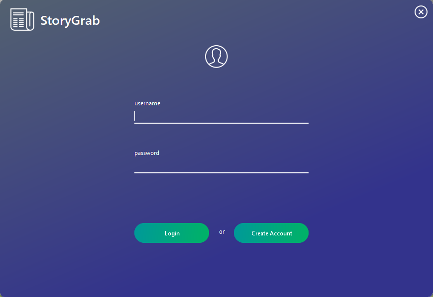
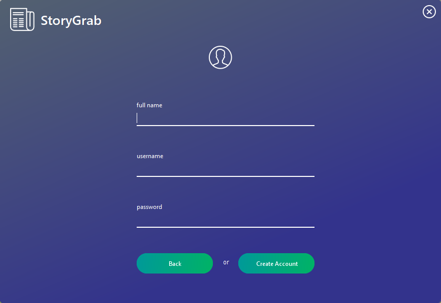
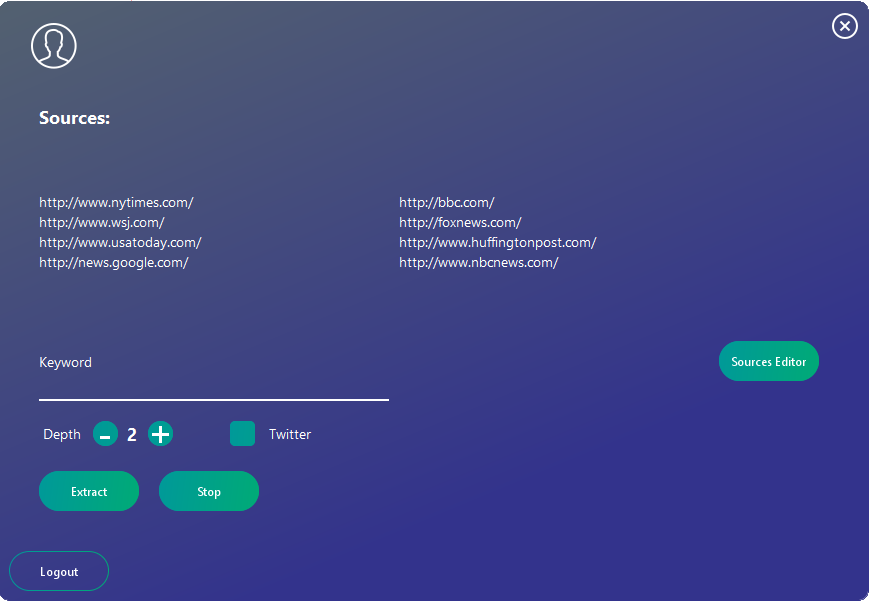

# StoryGrab
Required library: Kcontrols
  I got get rid of the Create Account screeen so usernames & passwords don't need to be stored in a separate file. It is more secure as AEP credentials for authenticating web traffic are never stored outside of a temporary variable in the main program.

# Screenshots: 
Login screen:

Create Account screen:

Main screen (current):

Not much yet in the main sceen, a lot more later
